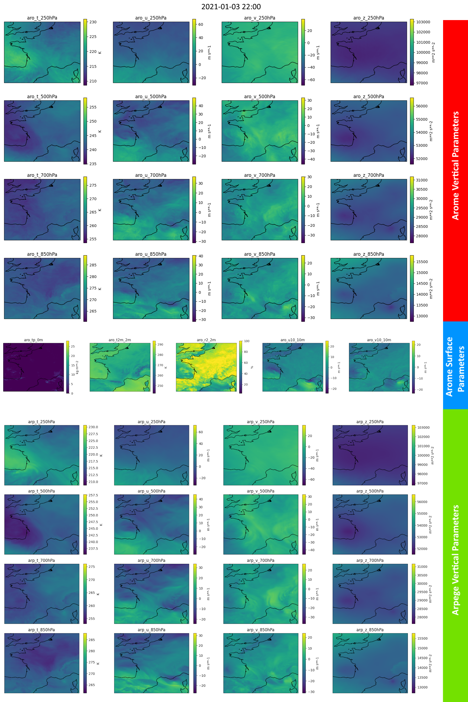

With the rise of deep learning models for weather forecasting, there’s a growing need for high-quality datasets that can help train neural networks to make reliable predictions. TITAN, a dataset specifically designed for this purpose, aims to bridge this gap by offering extensive meteorological data focused on France’s metropolitan area.

## What is TITAN?

TITAN is a comprehensive weather dataset created to train deep neural networks for forecasting meteorological conditions. This dataset focuses on surface-level weather parameters as well as data from four different atmospheric layers, providing a rich, multi-dimensional perspective on France's weather patterns.



## Key Features of TITAN

1. **Geographical Focus**: The dataset is centered on France's metropolitan area, covering a wide range of geographical and climatic conditions.

2. **Multiple Weather Parameters**: TITAN includes 5 key meteorological variables, both at the surface and at multiple levels in the atmosphere. These parameters are critical for understanding and predicting weather patterns. They include: Temperature, Geopotential, Humidity, Wind and Precipitation rates.

3. **Four Atmospheric Levels**: In addition to surface-level data, TITAN provides meteorological measurements at four different heights in the atmosphere, offering deeper insights into vertical weather dynamics. These levels are essential for predicting complex phenomena like thunderstorms, heavy rainfall, and wind shear. These levels are 250, 500, 700 and 850 hPa.

4. **Source and Timeframe**: The data in TITAN is derived from the Arome and Arpege models, two highly respected systems for meteorological analysis and forecasting. The dataset includes both analysis and forecast data, available at a 1-hour timestep for a period of 5 years. This extensive temporal range enables researchers to study long-term trends and train models to make predictions over a significant historical window.

5. **Primary Focus on Arome Analysis**: For each hourly timestep, we chose to primarily provide Arome analysis data, which represents the best estimate of the current atmospheric state, essentially acting as the ground truth. Arome analysis gives the most accurate reflection of conditions at that time. In addition, we offer Arpège data as a coupling model, which can be used to test the incorporation of boundary conditions. For Arpège, a run is available every 6 hours, and every sixth timestep is an analysis, with the remaining timesteps representing forecast data. It is important to note that Arpège forecast data and analysis do not overlap; for any given timestep, there is only one valid Arpège data point, either analysis or forecast.

6. **Compact by Design**: To ensure that the dataset is easily usable and accessible, we deliberately kept it small, under 1 terabyte of data. By focusing on a limited number of atmospheric levels and parameters, TITAN provides a balance between detail and efficiency, making it well-suited for quick integration and experimentation without overwhelming storage or computational resources.

7. **Designed for efficient training**: The dataset is formatted to be directly usable by deep learning frameworks. For each hourly timestep, we provide one NPY file per parameter and atmospheric level, making it quick to load on a GPU and easy to select a subset of parameters for specific experiments.


## Conclusion

TITAN is an invaluable resource for meteorologists, data scientists, and researchers working in the field of weather forecasting. By providing rich, multi-level atmospheric data, it opens up new opportunities for applying deep learning techniques to predict France’s weather with greater precision.

As weather patterns become increasingly unpredictable due to climate change, datasets like TITAN will play a crucial role in improving the resilience and accuracy of forecasting systems. Stay tuned for more insights on how TITAN can transform the future of meteorological research.


## Details on available data and parameters

* **Data Sources**: Analyses and forecasts from AROME and ARPEGE NWP models
* **Format**: NPY
- **Resolution**: 2.5km
- **Historical Data**: 5 years, 2020-2024
- **Time Step**: 1 Hour
- **XX Weather Parameters**:
  - **5 Surface Variables**: Temperature, humidity, wind (u & v), and precipitation
  - **4 Variables at 4 Vertical Levels**:
    - 850, 700, 500, 250 hPa
    - T, U, V, Z

**Note**: Precipitation is the only Arome parameter that is not an analysis. It is a AROME forecast made every hour, predicting the cumulative precipitation in mm for the next hour. In the future, we aim to use higher quality expertized radar data.


### Table of parameters

Data is grouped in folders per hour. Each hourly folder contains 37 npy files, one per weather parameter and level.

In the `source` column, we note (A) for model analysis data or (F) for forecast data.


| File name   | Name                      | Unit       | Source NWP Model | Levels |
| :---:       | :---:                     | :---:      | :---:            | :---:  |
│ aro_t2m_2m  | 2 meter temperature       │ K          │ Arome (A)        | 2m       |
│ aro_r2_2m   | 2 metre relative humidity │ %          │ Arome (A)        | 2m       |
│ aro_tp_0m   | Total Precipitation       │ kg m**-2   │ Arome (F)        | 0m       |
│ aro_u10_10m | 10 metre U wind component │ m s**-1    │ Arome (A)        | 10m       |
│ aro_v10_10m | 10 metre V wind component │ m s**-1    │ Arome (A)        | 10m       |
│ aro_t_XhPa  | Temperature               │ K          │ Arome (A)        | 250, 500, 700, 850 hPa |
│ aro_u_XhPa  | U component of wind       │ m s**-1    │ Arome (A)        | 250, 500, 700, 850 hPa |
│ aro_v_XhPa  | V component of wind       │ m s**-1    │ Arome (A)        | 250, 500, 700, 850 hPa |
│ aro_z_XhPa  | Geopotential              │ m**2 s**-2 │ Arome (A)        | 250, 500, 700, 850 hPa |
│ arp_t_XhPa  | Temperature               │ K          │ Arpege (A or F)  | 250, 500, 700, 850 hPa |
│ arp_u_XhPa  | U component of wind       │ m s**-1    │ Arpege (A or F)  | 250, 500, 700, 850 hPa |
│ arp_v_XhPa  | V component of wind       │ m s**-1    │ Arpege (A or F)  | 250, 500, 700, 850 hPa |
│ arp_z_XhPa  | Geopotential              │ m**2 s**-2 │ Arpege (A or F)  | 250, 500, 700, 850 hPa |


## Download

* Size of **compressed** 5 years archive : ~ XX Go

* Size of **uncompressed** 5 years archive : ~ XX Go

For now, 3 days of data stored on [HuggingFace](https://huggingface.co/datasets/meteofrance/titan)

To download :

```bash
# Make sure you have git-lfs installed (https://git-lfs.com)
git lfs install

git clone https://huggingface.co/datasets/meteofrance/titan
```
