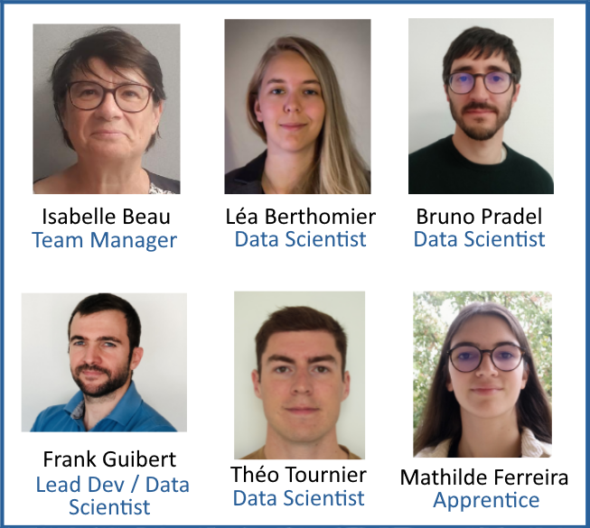
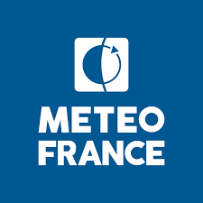

# About Meteo-France AI Lab

## Meteo-France's AI Lab

Meteo-France AI Lab is a small team of 6 people, created in 2019.

Our goal is to develop operational AI models for Météo-France and train people in AI.

**Current projects** :
* [py4cast](https://github.com/meteofrance/py4cast): a framework to train and compare multiple neural network architectures and datasets for AI forecasting; see [blogpost](_posts/2024-10-21-py4cast.md).
* AI Limited Area Forecasting on France (Collaboration with CNRM and Eviden): see [blogpost on first results](_posts/2024-10-21-py4cast-titan-neural-network-comparison.md).
* [mfai](https://github.com/meteofrance/mfai): a Python package that provides a variety of PyTorch Neural Network architectures (CNN, Vision Transformers, ...) adapted to our needs.
* Writing marine weather reports with LLMs.
* Precipitation nowcasting; check out [this repo](https://github.com/meteofrance/dgmr) to make forecasts with [Google Deepmind's DGMR](https://www.nature.com/articles/s41586-021-03854-z) on Meteo-France real-time radar data.
* Detection of weather fronts on global weather forecasts.
* Detection of Sargassum Algae on satellite images.
* Nowcasting of fog for airports.

**Older projects** :
* [DeepCloud](https://arxiv.org/abs/2009.11577): Cloud Cover Nowcasting with Deep Learning.
* [Espresso](https://www.mdpi.com/2674-0494/2/4/25): A Global Deep Learning Model to Estimate Precipitation from Satellite Observations
* Cleaning radar images to remove non-meteorological echoes.

## Meteo-France

**Meteo-France** is the French national meteorological service, responsible for monitoring and forecasting weather conditions across France and its overseas territories. Established in 1993, Meteo-France plays a crucial role in providing accurate and timely weather information to the public, government agencies, and various industries. With a network of advanced weather stations, satellites, and radar systems, Meteo-France ensures comprehensive coverage and precise weather predictions. The organization is also involved in climate research, contributing valuable data and insights to the global scientific community.

In addition to weather forecasting, Meteo-France offers a range of services including climate monitoring, air quality assessments, and natural disaster warnings. The agency collaborates with international meteorological organizations to enhance global weather prediction capabilities and improve our understanding of climate change. Through its commitment to innovation and excellence, Meteo-France continues to safeguard lives, support economic activities, and promote environmental sustainability.